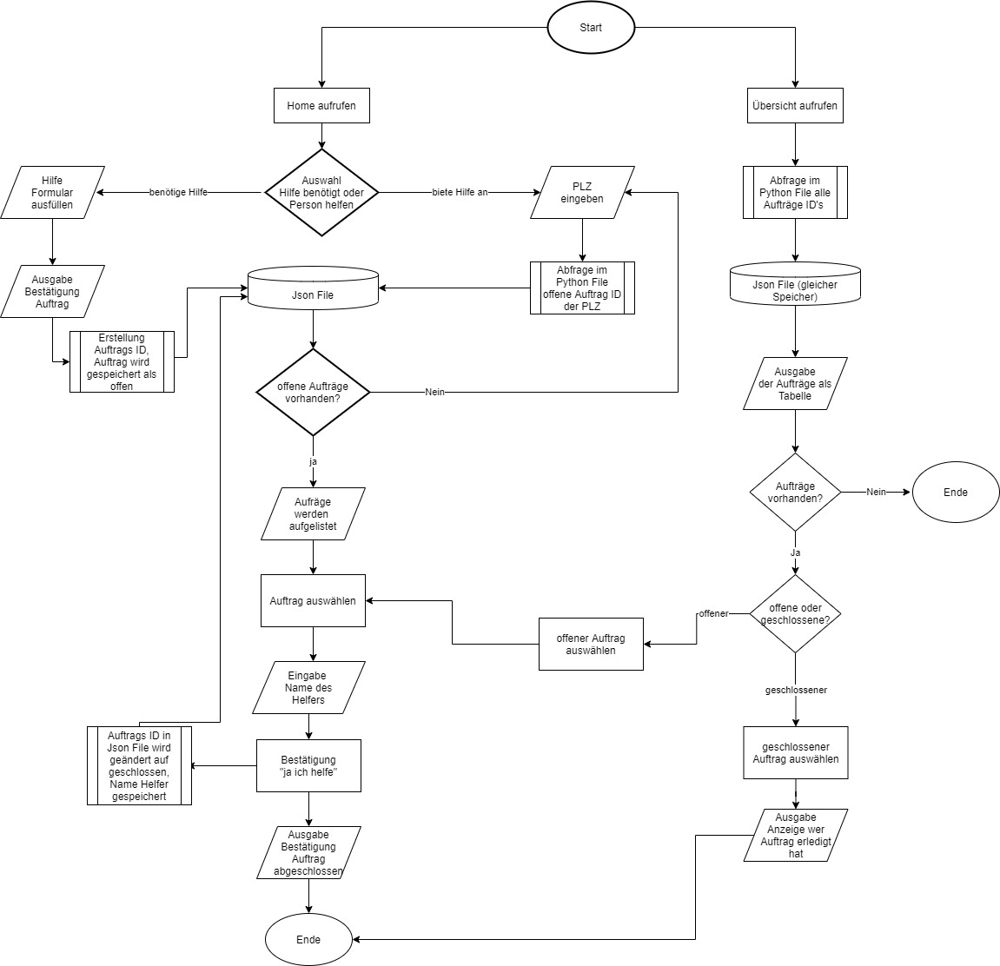

**Zugriff auf die Webapplikation** 
Die Webapplikation lässt sich mit folgender url aufrufen:
http://127.0.0.1:5000/home/

**Projektidee**  
Webapplikation zur Förderung der Nachbarschaftshilfe während der COVID-19 Krise

**Ausgangslage** 
Seit dem Ausbruch der Pandemie sind Personen aus der Risikogruppe besonders im Alltag von der Krise betroffen. Alltägliche Dinge wie Einkaufen oder bei der Post etwas abholen, kann für sie bereits ein grosses Risiko darstellen. Meine Webapplikation soll die Solidarität in den Regionen fördern und es den betroffenen Personen ermöglichen Hilfe anzufordern. Freiwillige können dann via PLZ prüfen, wer im Dorf/Stadt hilfe braucht und können sich anschliessend an die Person wenden, um den Auftrag auszuführen. 

**Funktion** 
Es soll eine zweiseitige Plattform entstehen. Einerseits zur Eingabe der Hilfeaufträge der betroffenen Personen in der Maske "Benötige Hilfe". Sie können via Formular eintragen bei was, wann und wo sie Hilfe brauchen. Nach der Eingabe des/r Benutzer/in wird der Eintrag in der Datenbank gespeichert und der Person bestätigt. Die freiwilligen Helfer/innen können über die Navigation "Möchte helfen" auf die entsprechende Maske zugreifen und über die PLZ die Aufträge der hilfsbedürftigen Personen in ihrer Nähe abrufen. Anschliessend wird die Übersicht der offenen Aufträge in der Ortschaft angezeigt. Der Auftrag kann ausgewählt und muss anschliessend per Name des Helfers/in bestätigt werden. Die Auswahl wird bestätigt und der Auftrag in der Datenbank somit geschlossen.  Zusätzlich können in der Übersicht alle Aufträge nachgeschaut werden, sowohl die offenen als auch die erledigten Hilfeanträge. Erledigte Aufträge können geprüft werden, nach dem Namen der Helfer/in. Offene Aufträge können ausgewählt und erledigt werden. Dies dient sowohl für die hilfsbedürftigen Personen als auch den Helfer/innen zur Hilfe, die Übersicht zu behalten - in erster Linie aber dem Administrator der Webapplikation.

**Workflow** 
**Dateneingabe** 
Hilfsbedürftige Person geht auf "benötige Hilfe" aus dem Startmenü und wählt im Formular aus, wobei sie Hilfe braucht, sowie persönliche Kontaktdaten. Die Person, welche Hilfe anbieten möchte, kann aus der Home Navigation "möchte helfen" auswählen und gelangt zur Eingabe der lokalen PLZ. Wenn der Auftrag ausgewählt wurde muss der Name der helfenden Person eingegeben und die Hilfe bestätigt werden. Offene Aufträge können auch aus der Übersicht ausgewählt und bearbeitet werden.  
**Datenverarbeitung** 
Die Anfrage wird als Dictionary entgegengenommen und dann in einer Stammdatenbank (json Datei) mit einer Auftrags ID mit dem Status "offen" gespeichert. Wenn ein Auftrag abgeschlossen wird, wird der Eintrag anhand der ID gefunden und der Status umgeschrieben auf "geschlossen". Der name der helfenden Person wird im json File abgespeichert. Bei jedem neuen Eintrag wird die json Datei geladen und anschliessend komplett überschrieben und somit gespeichert. 
**Datenausgabe** 
Benötige Hilfe: Die Eingabe der Person wird in der Maske bestätigt.  
Möchte helfen: Die Json Datei wird nach der PLZ abefragt und listet alle offenen Aufträge ein.  
Auftrag ausgewählt: Der ausgewählte Auftrag wird angezeigt mit einer hinterlassenen Nachricht der hilfsbedürftigen Person.  
Auftrag erledigt: Bestätigung, dass der Auftrag erledigt wurde wird angezeigt mit der ID des Auftrags, dieser wird geschlossen.   
Übersicht: Die ganze Datei wird in zwei Tabellen unterteilt offene Aufräge und geschlossene Aufträge. Die offenen Aufträge werden anhand der PLZ sortiert und die Frist in rot, orange oder grün angezeigt aufgund der ausstehenden Deadline (Deadline Vergangenheit, heute/morgen,+2 Tage).
Die geschlossenen Aufträge werden anhand des Namens aufgelistet. So kann die Person ihr Ticket finden und einsehen, wer Ihr geholfen hat.
Der Name der helfenden Person wird bei der Auswahl des geschlossenen Auftrags angezeigt. 

**Ablaufdiagramm**

=======

